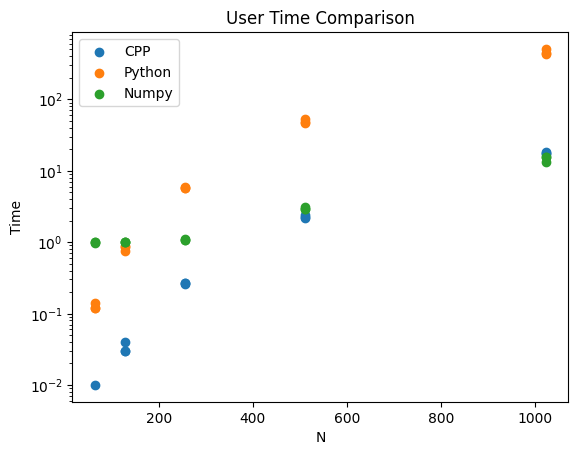
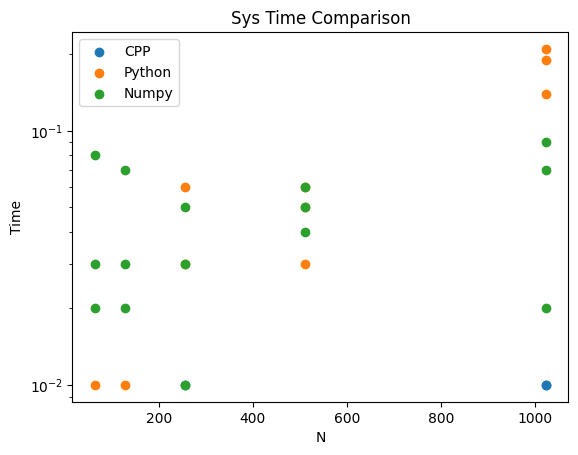
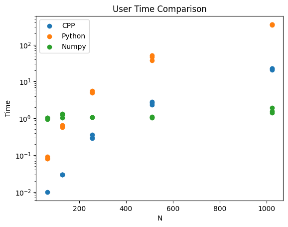
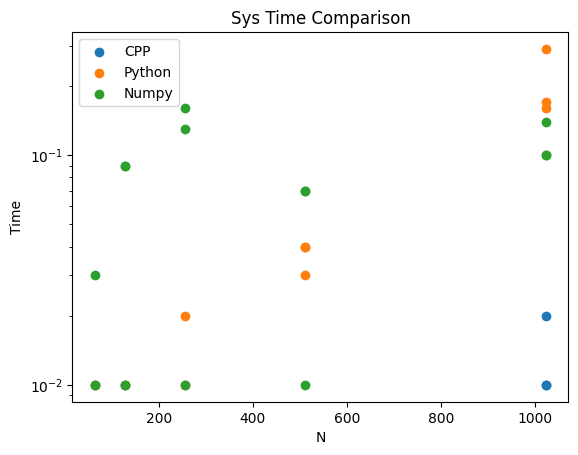

# Assignment 1

**Course:** ES 215: Computer Organization and Architecture <br>
**Name:** Ekansh Somani <br>
**Roll Number:** 20110065 <br>
**Github Repository Link:** [github.com/EkanshSomani/ES215Submissions](https://github.com/Ekanshsomani/ES215Submissions/tree/main)

## Table of Contents
- [Assignment 1](#assignment-1)
  - [Table of Contents](#table-of-contents)
  - [Q1](#q1)
    - [Table 1: Time Taken (in seconds)](#table-1-time-taken-in-seconds)
    - [Table 2: Speed Comparison (faster by factor)](#table-2-speed-comparison-faster-by-factor)
    - [Conclusion](#conclusion)
  - [Q2](#q2)
    - [Case A: Integer Data Type](#case-a-integer-data-type)
    - [Case B: Double Data Type](#case-b-double-data-type)
    - [Conclusion](#conclusion-1)
  - [Appendix](#appendix)
    - [A1: Q1 Code](#a1-q1-code)

## Q1

**Implement a program(s) to list the first 50 fibonacci numbers preferably in C++ using recursion, loop, recursion and memoization, and loop and memoization.**

My code for this question is given in Appendix A1.

Points to keep in mind:

- Fiftieth fibonnaci number is 12.5 billion (approx.). Integer type would thus not work, as unsigned int can go at max upto 4 billion (approx.). I would thus be working with unsigned long long.
- We should obtain multiple values of runtimes and then take mean. Errors might otherwise creep into the time taken because of the background processes running on the CPU.
- Since it takes about 3 minutes to determine run times for 50 fibonacci numbers, I have only tried to do it once. I calculated n=15, 30 and 40 fibonacci numbers for speed comparison otherwise.
- In recursion with Memoization, list could be created by simply calling the function once for the highest value, or it could be created incrementally. I have reported results for both the ways.

### Table 1: Time Taken (in seconds)
| Method | Recursion | Loops &nbsp;&nbsp;&nbsp; | Memoized Recursion | Memoized Recursion (single call) | Memoized Loops |
| --- | --- | --- | --- | --- | --- |
| n=50 | 160.151 | 3.6e-06 | 7e-07 | 5e-07 | 2e-07 |
| n=15 | 4.1e-06 | 3.2e-07 | 1.8e-07 | 1.4e-07 | 7e-08 |
| n=30 | 0.00717726 | 1.67e-06 | 5.4e-07 | 3.5e-07 | 2.1e-07 |
| n=40 | 0.711401 | 2.44e-06 | 6.7e-07 | 4.6e-07 | 1.9e-07 |

### Table 2: Speed Comparison (faster by factor)
| Method | Recursion | Loops | Memoized Recursion (incr) | Memoized Recursion | Memoized Loops |
| --- | --- | --- | --- | --- | --- |
| n=50 | 1 | 44.5 million | 228.8 million | 320.3 million | 800.8 million |
| n=15 | 1 | 12.8125 | 22.7778 | 29.2857 | 58.5714 |
| n=30 | 1 | 4297.76 | 13291.2 | 20506.5 | 34177.4 |
| n=40 | 1 | 291558 | 1.1 million | 1.55 million | 3.75 million |

**Notes:** 10 iterations were done for deriving the mean time taken for n=15, 30 and 40.

### Conclusion

Memoized loops are the fastest way to compute fibonacci numbers. Single Function call Memoized Recursion is faster than incremental memoized recursion. Loops is 44.5 miilion times faster than recursion for calculating 50 fibonacci number. Memoized recursion is 320 million time faster, whereas Memoized loops are 800 million times faster than recursion. Speed difference between the methods increases exponentially with n.

## Q2

**Write a simple Matrix Multiplication program for a given NxN matrix in C++ and Python, where N is iterated through the set of values 64, 128, 256, 512 and 1024. N can either be hardcoded or specified as input. Consider two cases (a) Elements of matrix are of data type Integer and (b) Double. In each case,**

1. **Report the output of the ‘time’ describing the system and CPU times**
2. **Using the ‘language hooks’ evaluate the execution time for the meat portions of the program and how much proportion is it w.r.t. total program execution time.**
3. **Plot the (a) and (b) execution times for each of the iterations. And compare the performance (System and Program execution times) of the program for given value of N for the languages.**
 
**Illustrate your observations.**

``time`` command gives ``real``, `user` and `sys` time as the output. Real time is wall clock time from start to finish of the call. User tells me the amount of time spent in user space actually excecuting the code, whereas Sys tells me the time spent in system calls within the kernel. user+sys will give me the actual cpu time used by the process.

Now, the question leaves me confused regarding a lot of things. So here are the assumptions I make:

- C++ program is assumed to be pre-compiled. In other words, I use time command to only measure the execution time and use it as program execution time.
- For Part 1, I report the `user` and `sys` times as CPU and system time asked for in question.
- For Part 2:
  - Total Program Execution Time = `user` + `sys` + 0.01.
  - Initializing variables and Executing the multiplication are the two meat portions I focus on.
  - I had to add 0.01 total program execution time because of the low precision of the time command in linux. This however means that the values for low N aren't reliable, as they are in the range of 0.00 to 0.05. Thus, the final proportion for the meat part was assumed to be the one returned by higher values of N.
- For Part 3:
  - Program Execution time = `user` time
  - System time = `sys` time

<!-- 
My Output Report (dimensions of the output)
- n (5 values)
- Int or Float (2 values)
- program type (3 values)
- user, sys, meat1, meat2 (4 values)
- median, standard deviation $\pm$
 -->

Also a note regarding the tables:

- All the times given are in seconds.
- Table entries are in the form median $\pm$ standard deviation.
- Table for each language will report time it took to execute the meat portion, real time, user time, sys time and mean of ratios of meat time to execution time for all values of n.
- Row for the ratio of meat time to execution time is labelled as prop. Mean of proportion is also given for all values of N and last 3 values of N after each tbale.

### Case A: Integer Data Type

| C++ | 64 | 128 | 256 | 512 | 1024 |
| --- | --- | --- | --- | --- | ---- |
| meat | 0.005±0.001 | 0.035±0.005 | 0.268±0.002 | 2.271±0.114 | 17.947±0.492 |
| real | 0.010±0.006 | 0.040±0.010 | 0.270±0.006 | 2.280±0.116 | 17.960±0.494 |
| user | 0.000±0.006 | 0.030±0.006 | 0.270±0.006 | 2.260±0.117 | 17.950±0.494 |
| sys | 0.000±0.000 | 0.000±0.000 | 0.000±0.006 | 0.000±0.000 | 0.010±0.006 |
| prop | 0.383 | 0.817 | 0.960 | 0.997 | 0.999 |

mean of proportion: 
  - Over all values of N: 0.8311617929811957
  - Over last 3 values of N: 0.9853


| Python | 64 | 128 | 256 | 512 | 1024 |
| --- | --- | --- | --- | --- | ---- |
| meat | 0.120±0.008 | 0.852±0.087 | 5.786±0.137 | 48.938±3.065 | 451.557±40.034 |
| real | 0.15±0.023 | 0.88±0.083 | 5.82±0.135 | 48.99±3.075 | 451.67±40.018 |
| user | 0.12±0.012 | 0.86±0.074 | 5.78±0.106 | 48.94±3.067 | 451.44±40.059 |
| sys | 0.0±0.006 | 0.0±0.006 | 0.03±0.030 | 0.05±0.015 | 0.19±0.036 |
| prop | 0.865 | 0.977 | 0.995 | 0.999 | 0.999 |

mean of proportion:
  - Over all values of N: 0.9675217952976901
  - Over last 3 values of N: 0.997


| Numpy | 64 | 128 | 256 | 512 | 1024 |
| --- | --- | --- | --- | --- | ---- |
| meat | 0.000±0.000 | 0.002±0.001 | 0.065±0.008 | 1.971±0.063 | 14.811±1.499 |
| real | 0.190±0.099 | 0.200±0.040 | 0.260±0.017 | 2.160±0.070 | 14.970±1.507 |
| user | 0.990±0.025 | 1.020±0.017 | 1.070±0.015 | 2.940±0.089 | 15.810±1.524 |
| sys | 0.030±0.032 | 0.030±0.026 | 0.030±0.020 | 0.050±0.010 | 0.070±0.036 |
| prop | 0.000 | 0.003 | 0.060 | 0.653 | 0.929 |

mean of proportion: 
  - Over all values of N: 0.32912055200433005
  - Over last 3 values of N: 0.5473

**Graphs:**




Note: There are supposed to be 3 points for each language for each value of N. Some points are missing because zero values aren't visible as y is on log scale. Thus missing points should be assumed to be zero.

### Case B: Double Data Type

| C++ | 64 | 128 | 256 | 512 | 1024 |
| --- | --- | --- | --- | --- | ---- |
| meat | 0.006±0.002 | 0.033±0.003 | 0.298±0.036 | 2.663±0.225 | 22.399±1.171 |
| real | 0.010±0.006 | 0.040±0.000 | 0.300±0.035 | 2.670±0.224 | 22.420±1.169 |
| user | 0.000±0.006 | 0.030±0.000 | 0.300±0.038 | 2.660±0.228 | 22.400±1.175 |
| sys | 0.000±0.006 | 0.000±0.006 | 0.000±0.000 | 0.000±0.000 | 0.010±0.006 |
| prop | 0.350 | 0.810 | 0.971 | 0.996 | 0.999 |

mean of proportion:
  - Over all values of N: 0.8252008922063341
  - Over last 3 values of N: 0.9886

| Python | 64 | 128 | 256 | 512 | 1024 |
| --- | --- | --- | --- | --- | ---- |
| meat | 0.079±0.006 | 0.610±0.049 | 5.074±0.360 | 46.664±6.880 | 350.864±6.601 |
| real | 0.110±0.006 | 0.640±0.045 | 5.110±0.356 | 46.710±6.882 | 350.980±6.601 |
| user | 0.080±0.006 | 0.610±0.040 | 5.100±0.358 | 46.640±6.870 | 350.750±6.529 |
| sys | 0.000±0.006 | 0.000±0.006 | 0.010±0.010 | 0.040±0.006 | 0.170±0.072 |
| prop | 0.831 | 0.975 | 0.994 | 0.999 | 1.000 |

mean of proportion:
  - Over all values of N: 0.9598278695399358
  - Over last 3 values of N: 0.9976


| Numpy | 64 | 128 | 256 | 512 | 1024 |
| --- | --- | --- | --- | --- | ---- |
| meat | 0.000±0.000 | 0.008±0.003 | 0.009±0.002 | 0.013±0.000 | 0.056±0.023 |
| real | 0.180±0.015 | 0.220±0.021 | 0.200±0.036 | 0.190±0.012 | 0.260±0.032 |
| user | 1.030±0.055 | 1.260±0.155 | 1.070±0.012 | 1.060±0.046 | 1.540±0.272 |
| sys | 0.010±0.015 | 0.090±0.046 | 0.130±0.079 | 0.070±0.035 | 0.100±0.023 |
| prop | 0.000 | 0.005 | 0.007 | 0.012 | 0.039 |

mean of proportion:
  - Over all values of N: 0.012631899668762308
  - Over last 3 values of N: 0.0193

**Graphs:**




### Conclusion

- Python is extremely slow. C++ is much faster than Python. But Python with Numpy gives almost the same and in many cases faster performance than C++. 
- C++ slows down a bit for operation on the doubles. No such effect is observed on Python and Numpy. This leads Numpy being much faster than C++ for operation on doubles.
- Meat portions consitute about 98% of execution time for Python and C++. But for Numpy, that portion is about 50% at low values of N. But still reaches above 90% for higher values for Integer data types. But its less than 20% for Float data types. 
  - This indicates that a lot of speedup is still possible for Python and C++, as the multiplications can be parellelized.
  - But for Numpy with Float data types, the speedup won't be that much.
  
I haven't added the code for this question in appendix. Please refer to the github repository for the code.

## Appendix

### A1: Q1 Code

``` C++

#include <bits/stdc++.h>

using namespace std;

typedef unsigned long long ull;
typedef vector<double> vd;

ull fibrec[51], fibloop[51], fibdp[51], fibopt[51];

inline ull rec(int i)
{
    if(i<=2) return 1ULL;
    return rec(i-1)+rec(i-2);
}

inline ull loop(int i)
{
    ull ans{1}, prev{1}, temp;
    for(int j=3; j<=i; j++)
    {
        temp = ans;
        ans += prev;
        prev = temp;
    }
    return ans;
}

inline ull dp(int i)
{
    if(fibdp[i]!=0ULL) return fibdp[i];

    return fibdp[i] = dp(i-1)+dp(i-2);
}

inline void optimal(int upto)
{
    fibopt[1] = 1;
    fibopt[2] = 1;
    for(int i=3; i<upto; i++) fibopt[i] = fibopt[i-1]+fibopt[i-2];
}

/*
// testing that functions are correct
int main()
{
    memo[1] = 1;
    memo[2] = 1;
    optimal();

    printf(
        "1st Fibonacci number: %llu %llu %llu %llu\n", 
        rec(1), loop(1), dp(1), fibs[1]
    );
    printf(
        "5th Fibonacci number: %llu %llu %llu %llu\n", 
        rec(5), loop(5), dp(5), fibs[5]
    );
    printf(
        "15th Fibonacci number: %llu %llu %llu %llu\n", 
        rec(15), loop(15), dp(15), fibs[15]
    );
    printf(
        "50th Fibonacci number: %llu %llu %llu %llu\n", 
        rec(50), loop(50), dp(50), fibs[50]
    );
    return 0;
}
*/

inline vd getTimes(int upto)
{
    memset(fibrec, 0ULL, sizeof fibrec);
    memset(fibloop, 0ULL, sizeof fibloop);
    memset(fibdp, 0ULL, sizeof fibdp);
    memset(fibopt, 0ULL, sizeof fibopt);

    double recTime, loopTime, dpTime, dpTime1, optTime;
    timespec start, end;


    clock_gettime(CLOCK_MONOTONIC, &start);
    for(int i=1; i<upto; i++) fibrec[i] = rec(i);
    clock_gettime(CLOCK_MONOTONIC, &end);

    recTime = (end.tv_sec - start.tv_sec) * 1e9;
    recTime = (recTime + (end.tv_nsec - start.tv_nsec)) * 1e-9;
 

    clock_gettime(CLOCK_MONOTONIC, &start);
    for(int i=1; i<upto; i++) fibloop[i] = loop(i);
    clock_gettime(CLOCK_MONOTONIC, &end);

    loopTime = (end.tv_sec - start.tv_sec) * 1e9;
    loopTime = (loopTime + (end.tv_nsec - start.tv_nsec)) * 1e-9;

    clock_gettime(CLOCK_MONOTONIC, &start);
    fibdp[1] = 1; fibdp[2] = 1;
    for(int i=1; i<upto; i++) dp(i);
    clock_gettime(CLOCK_MONOTONIC, &end);

    dpTime = (end.tv_sec - start.tv_sec) * 1e9;
    dpTime = (dpTime + (end.tv_nsec - start.tv_nsec)) * 1e-9;


    memset(fibdp, 0ULL, sizeof fibdp);
    clock_gettime(CLOCK_MONOTONIC, &start);
    fibdp[1] = 1; fibdp[2] = 1; dp(upto-1);
    clock_gettime(CLOCK_MONOTONIC, &end);

    dpTime1 = (end.tv_sec - start.tv_sec) * 1e9;
    dpTime1 = (dpTime1 + (end.tv_nsec - start.tv_nsec)) * 1e-9;

    clock_gettime(CLOCK_MONOTONIC, &start);
    optimal(upto);
    clock_gettime(CLOCK_MONOTONIC, &end);

    optTime = (end.tv_sec - start.tv_sec) * 1e9;
    optTime = (optTime + (end.tv_nsec - start.tv_nsec)) * 1e-9;

    vd vec = {recTime, loopTime, dpTime, dpTime1, optTime};
    return vec;
}

inline void speedComp(vd vec)
{
    cout << "Time: ";
    for(int i=0; i<5; i++) cout << vec[i] << " ";
    cout << "\n" << "Speed Comparison: ";
    for(int i=0; i<5; i++) cout << vec[0]/vec[i] << " ";
    cout << "\n";
}

int main()
{
    // vd vec = getTimes(51);
    // speedComp(vec);

    vd vec(5);
    vd vecs[10];
    for(int i=0; i<10; i++)
        vecs[i] = getTimes(45);

    for(int i=0; i<5; i++)
    {
        vec[i] = 0;
        for(int j=0; j<10; j++)
            vec[i] += vecs[j][i];
        vec[i] /= 10;
    }
    speedComp(vec);

    return 0;
}

```


