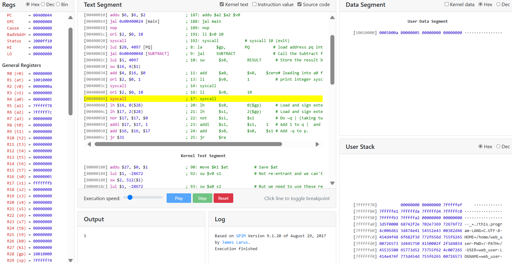
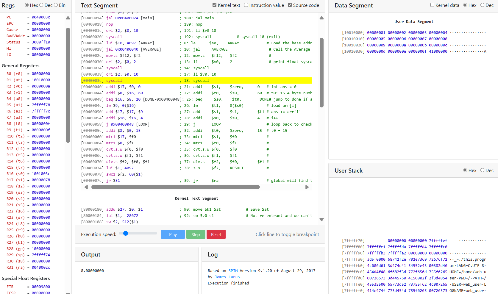
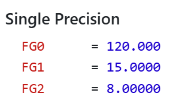
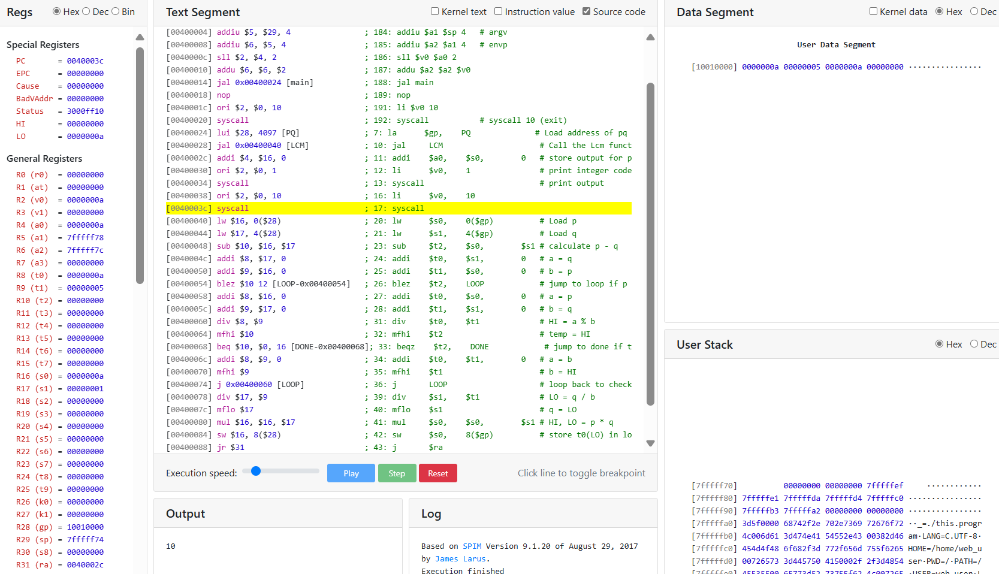
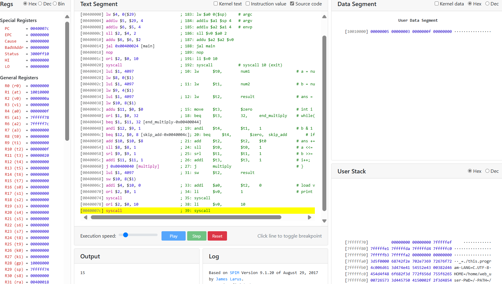
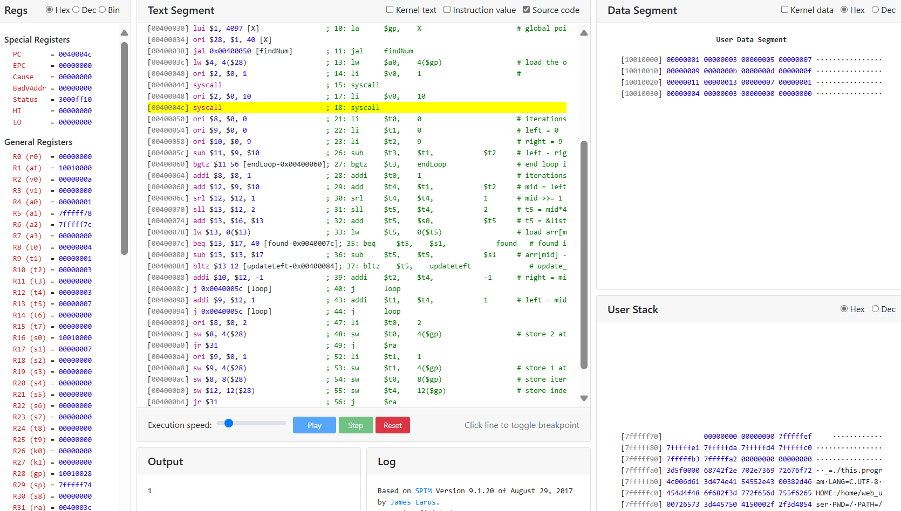
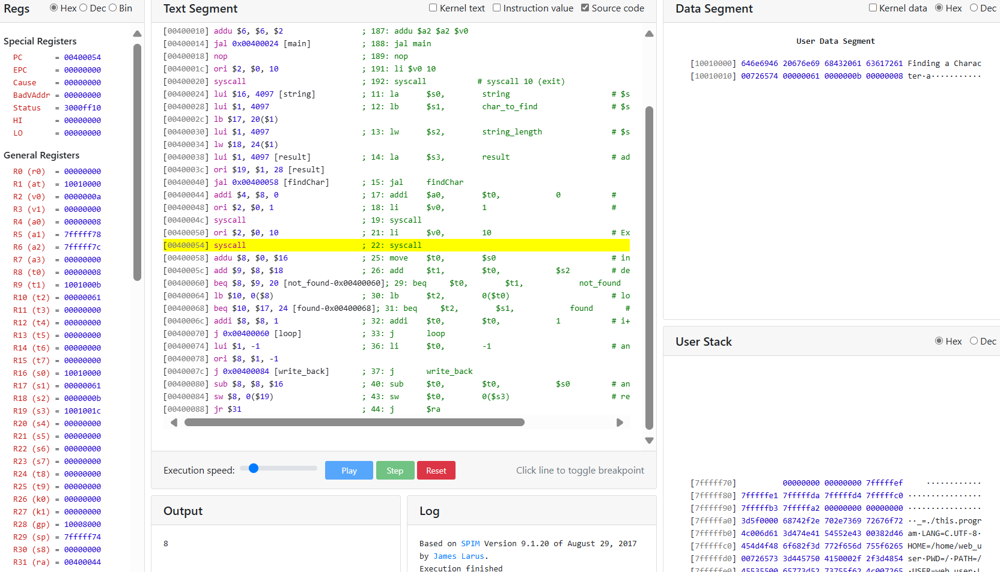

Name: Ekansh Somani <br>
Roll Number: 20110065 <br>
Github: [Assignment 3 Code](https://github.com/Ekanshsomani/ES215Submissions/tree/00a8eb156b2cfb55d68b7d139e9f4fdda83dcf48/Assignment%203) <br>
Course: ES 215: Computer Organization and Architecture

**Note:** Comments in the code might end up getting truncated in the report. Please refer to the github repository in case the code isn't printed correctly.

## Table of Contents
- [Table of Contents](#table-of-contents)
- [Q1](#q1)
- [Q2](#q2)
- [Q3](#q3)
- [Q4](#q4)
- [Q5](#q5)
- [Q6](#q6)


## Q1

**Write a program in assembly language to subtract two 16 bit numbers without using the subtraction instruction. Note: the numbers have to be fetched from the memory.**

C++ Code:

```cpp
int subtract(int16_t a, int16_t b)
{
    int32_t p = a; // sign extension from
    int32_t q = b; // 16 to 32 bits

    q = ~q;
    q = q + 1;
    return p+q;
}
```

MIPS Assembly Code:

```asm
.data
PQ:     .half   10, 5                   # Example value for p and q
RESULT: .word   0                       # To store the result

.text
        .globl  main
main:
    la      $gp,        PQ              # load address pq into gp
    jal     SUBTRACT                    # Call the Subtract function
    sw      $s0,        RESULT          # Store the result back to memory
    add     $a0,        $s0,    $zero   # loading into a0 for printing

    li      $v0,        1               # print integer syscall code
    syscall

    li      $v0,        10
    syscall

SUBTRACT:
    lh      $s0,        0($gp)          # Load and sign extend a to get p
    lh      $s1,        2($gp)          # Load and sign extend b to get q
    not     $s1,        $s1             # Do ~q | (taking two's complement -
    addi    $s1,        $s1,    1       # Add 1 to q |  and getting -q)
    add     $s0,        $s0,    $s1     # Add -q to p.
    jr      $ra
```



Assembly code’s Output is 5. (Correct: 10 - 5 = 5)

## Q2

**Write an assembly language program to find an average of 15 numbers stored at consecutive locations in memory.**

C++ Code:

```cpp

float average(int arr[])
{
    int ans = 0;
    int i = 0;
    while(i<15)
    {
        ans += arr[i];
        i++;
    }

    return ans/15.00;
}
```

MIPS Assembly Code:

```assembly
.data
ARRAY: .word 1, 2, 3, 4, 5, 6, 7, 8, 9, 10, 11, 12, 13, 14, 15  # Example array
RESULT: .word 0   # To store the result

.text
.globl main
main:
    la      $s0,    ARRAY            # Load the base address of the array into $s0

    jal     AVERAGE                  # Call the Average function

    mov.s   $f12,   $f2              #
    li      $v0,    2                # print float syscall code
    syscall

    # Exit the program
    li $v0, 10
    syscall

AVERAGE:                            # array address comes in $s0 (assume)
    addi    $s1,    $zero,      0   # int ans = 0
    addi    $t0,    $s0,        60  # t0: 15 4 byte numbers ahead of s0

LOOP:
    beq     $s0,    $t0,        DONE# jump to done if at array end
    lw      $t1,    0($s0)          # load arr[i]
    add     $s1,    $s1,        $t1 # ans += arr[i]
    addi    $s0,    $s0,        4   # i++
    j       LOOP                    # loop back to check condition

DONE:
    addi    $t0,    $zero,      15  # t0 = 15
    mtc1    $s1,    $f0             #
    mtc1    $t0,    $f1             #
    cvt.s.w $f0,    $f0             #
    cvt.s.w $f1,    $f1             #
    div.s   $f2,    $f0,        $f1 # 
    s.s     $f2,    RESULT          #
    jr      $ra                     # global will find their answer in $LO
```



Code output is 8. (correct)



floating point registers state

## Q3

**Write an assembly language program to find an LCM of two numbers stored at consecutive locations in memory**

C++ Code:

```cpp
int lcm(int p, int q)
{
    int temp, a{p}, b{q};
    if(b > a)
    {
        temp = b;
        b = a;
        a = b;
    }

    temp = a % b;
    while(temp != 0)
    {
        a = b;
        b = temp;
        temp = a % b;
    }

    return p * (q / b);
}
```

Assembly Code:

```asm
.data
num1:   .word   5                               # First number
num2:   .word   3                               # Second number
result: .word   0                               # To store the result

.text
        .globl  main
main:
    # Load the numbers into registers
    lw      $t0,        num1                    # a = num1
    lw      $t1,        num2                    # b = num2
    lw      $t2,        result                  # ans = 0 (result)

    # Initialize temporary registers
    move    $t3,        $zero                   # int i = 0;

multiply:
    beq     $t3,        32,     end_multiply    # while(i < 32){
    andi    $t4,        $t1,    1               # b & 1
    beq     $t4,        $zero,  skip_add        # if(b & 1)
    add     $t2,        $t2,    $t0             # ans += a;

skip_add:
    sll     $t0,        $t0,    1               # a <<= 1;
    srl     $t1,        $t1,    1               # b >>= 1;
    addi    $t3,        $t3,    1               # i++;
    j       multiply                            # }

end_multiply:
    # Store the result back to memory
    sw      $t2,        result

    # Exit the program
    li      $v0,        10
    syscall
```



lcm output 10 for 5, 10 input

## Q4

**Write an assembly language program to calculate multiplication of two numbers without using MUL commands.**

C++ Code:

```cpp
int multiply(uint32_t a, uint32_t b)
{ // negative integers get static casted.
    uint32_t ans = 0;
    int i = 0;
    while(i < 32)
    {
        if(b & 1) ans += a;
        a <<= 1;
        b >>= 1;
        i++;
    }
    return ans; //return performs static cast
}
```

Assembly Code:

```nasm
.data
num1:   .word   5                               # First number
num2:   .word   3                               # Second number
result: .word   0                               # To store the result

.text
.globl  main
main:
    # Load the numbers into registers
    lw      $t0,        num1                    # a = num1
    lw      $t1,        num2                    # b = num2
    lw      $t2,        result                  # ans = 0 (result)

    # Initialize temporary registers
    move    $t3,        $zero                   # int i = 0;

multiply:
    beq     $t3,        32,     end_multiply    # while(i < 32){
    andi    $t4,        $t1,    1               # b & 1
    beq     $t4,        $zero,  skip_add        # if(b & 1)
    add     $t2,        $t2,    $t0             # ans += a;

skip_add:
    sll     $t0,        $t0,    1               # a <<= 1;
    srl     $t1,        $t1,    1               # b >>= 1;
    addi    $t3,        $t3,    1               # i++;
    j       multiply                            # }

end_multiply:
    # Store the result back to memory
    sw      $t2,        result

    addi    $a0,        $t2,    0               # load value into a0
    li      $v0,        1                       # print integer
    syscall

    # Exit the program
    li      $v0,        10
    syscall
```



Output is correct

## Q5

**Write an assembly language program to find a given number in the list of 10 numbers (assuming the numbers are sorted). If found store 1 in output, else store 2 in output.The given number has been loaded from X location in memory, the output has to be stored at the next location and if found store the number of iterations and the index of the element at the next at the next consecutive locations, if found.**

C++ Code:

```cpp
tuple<int, int, int> findNum(int arr[], int X)
{
    int iterations = 0;
    int left = 0;
    int right = 9;
    while(left <= right)
    {
        iterations++;
        int mid = (left + right) >> 1;
        if(arr[mid] == X) return {1, iterations, mid};
        else if(arr[mid] < X) left = mid + 1;
        else right = mid - 1;
    }

    return {2, -1, -1};
}
```

Assmbly Code

```asm
.data
list: .word 1, 3, 5, 7, 9, 11, 13, 15, 17, 19  # Sorted list of 10 numbers
X:    .word 7, 0, -1, -1                       # Given number to find and the memory to store the result

.text
.globl main
main:
    la      $s0,    list                    # Load base address of the list into $t0
    lw      $s1,    X
    la      $gp,    X                       # global pointer at X's address
    jal     findNum

    lw      $a0,    4($gp)                  # load the output for printing
    li      $v0,    1                       #
    syscall

    li      $v0,    10
    syscall

findNum:
    li      $t0,    0                       # iterations = 0
    li      $t1,    0                       # left = 0
    li      $t2,    9                       # right = 9

loop:
    sub     $t3,    $t1,            $t2     # left - right
    bgtz    $t3,    endLoop                 # end loop if left > right
    addi    $t0,    1                       # iterations++
    add     $t4,    $t1,            $t2     # mid = left + right
    srl     $t4,    $t4,            1       # mid >>= 1
    sll     $t5,    $t4,            2       # t5 = mid*4
    add     $t5,    $s0,            $t5     # t5 = &list + 4*(mid)
    lw      $t5,    0($t5)                  # load arr[mid]

    beq     $t5,    $s1,            found   # found if arr[mid] = X
    sub     $t5,    $t5,            $s1     # arr[mid] - X
    bltz    $t5,    updateLeft              # update_left if arr[mid] < x

    addi    $t2,    $t4,            -1      # right = mid - 1
    j       loop

updateLeft:
    addi    $t1,    $t4,            1       # left = mid + 1
    j       loop

endLoop:
    li      $t0,    2
    sw      $t0,    4($gp)                  # store 2 at output (right after X)
    j       $ra

found:
    li      $t1,    1
    sw      $t1,    4($gp)                  # store 1 at output
    sw      $t0,    8($gp)                  # store iterations
    sw      $t4,    12($gp)                 # store index of X
    j       $ra
```



output as 1. 4 iterations, and 3 index stored in data segment.

## Q6

 **Write an assembly language program to find a character in a string.**

C++ Code:

```cpp
int findChar(char arr[], char c, int arrLength)
{// function returns -1 if not found, otherwise 
// returns index of c in string

    int i = 0;
    while(i < arrLength)
    {
        if(arr[i] == c) return i;
        i++;
    }
    return -1;
}
```

Assembly Code:

```nasm
.data
string:         .asciiz "Finding a Character"       # Example string
char_to_find:   .byte   'a'                         # c = 'a'
string_length:  .word   11
result:         .word   0

.text
.globl  main

main:
    la      $s0,        string                      # $s0 = arr[]
    lb      $s1,        char_to_find                # $s1 = c
    lw      $s2,        string_length               # $s2 = arrLength
    la      $s3,        result                      # address to store the result
    jal     findChar

    addi    $a0,        $t0,            0           #
    li      $v0,        1                           #
    syscall

    li      $v0,        10                          # Exitting the program
    syscall

findChar:
    move    $t0,        $s0                         # int i = 0
    add     $t1,        $t0,            $s2         # define array end

loop:
    beq     $t0,        $t1,            not_found   # end if i==arrLength
    lb      $t2,        0($t0)                      # load arr[i]
    beq     $t2,        $s1,            found       # if arr[i] == c
    addi    $t0,        $t0,            1           # i++
    j       loop

not_found:
    li      $t0,        -1                          # ans = -1
    j       write_back

found:
    sub     $t0,        $t0,            $s0         # ans = &arr[i] - &arr

write_back:
    sw      $t0,        0($s3)                      # return ans
    j       $ra
```



Output for the code (8 as index of first occurence of a)